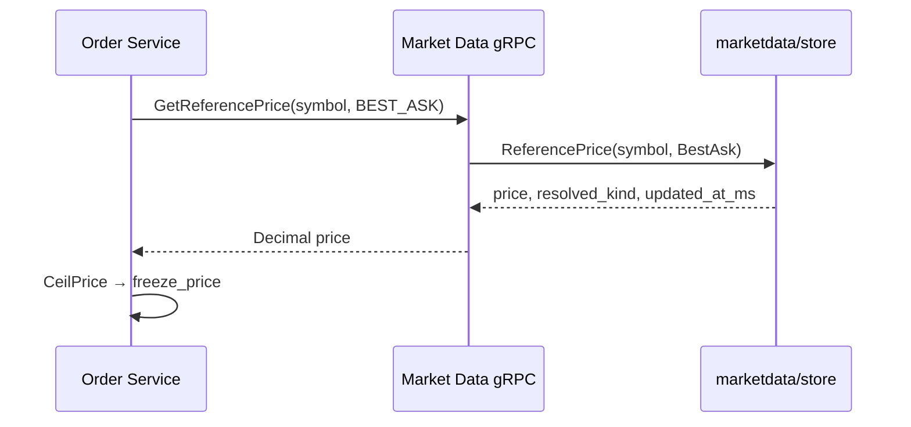

# 市价买单行情冻结（方案 C）

本文描述 Order Service 对**市价买单（MARKET + BUY）**的计价资产冻结策略，与当前代码实现一致。路线图见 [development-roadmap.md](../development-roadmap.md) 第 6 步 6.1。

## 1. 背景

市价买单在撮合前必须冻结足够的 **quote 资产**（如 USDT），但下单时用户未给出限价。若按「零价」或「极小价」冻结会导致：

- 余额冻结不足，成交后透支；
- 或过度冻结，占用流动性。

**方案 C**：以 **Market Data 实时参考价**（默认卖一 `BEST_ASK`）为基准，叠加可配置的 **滑点缓冲** 计算 `frozen_amount`；用户可选 **保护价** 作为 `freeze_price` 上限。

| 方案 | 概要 | 本仓库 |
|------|------|--------|
| A | 仅用户显式传 `price` 才允许市价买 | 未采用 |
| B | 固定比例/常量参考价 | 未采用 |
| **C** | Market Data `GetReferencePrice` + 滑点缓冲 | **已实现** |

## 2. 触发条件

同时满足时走冻结逻辑（见 `internal/order/service/order.go` `validatePlaceOrder`）：

- `type = MARKET`
- `side = BUY`

其他组合：

- **限价买单**：`freeze_price = price`，`frozen_amount = price × quantity`（无滑点项）。
- **市价卖 / 限价卖**：按 base 资产数量冻结，不写入 `freeze_price` / `freeze_slippage`（由 `ComputeFreeze` 按方向处理）。

## 3. 参考价来源

### 3.1 调用链



- Order 客户端：`internal/order/marketdata/marketdata_grpc.go`，固定请求 `REFERENCE_PRICE_KIND_BEST_ASK`。
- Market Data：`internal/marketdata/handler/server.go` `GetReferencePrice`。
- 内存镜像：`internal/marketdata/store/store.go` `ReferencePrice`。

### 3.2 降级顺序（`BEST_ASK`）

对 `ReferencePriceBestAsk`：

1. 订单簿 **最优卖价**（asks 最低价）；
2. 若无卖盘，使用 Ticker **最新价** `LAST`（`resolved_kind` 回传为 `LAST`）。

`MARK` / `LAST` 种类在 Store 中均回落到 Ticker 最新价（供 API 扩展；Order 当前仅用 `BEST_ASK`）。

### 3.3 用户保护价

若请求带正数 `price`（REST/gRPC 可选字段），则 **不再调用** Market Data，直接：

- `ValidatePrice` → `freeze_price`；
- 用于用户自设价格上限场景。

## 4. 冻结公式

配置项：`configs/order.json` → `marketdata.slippage_buffer`（默认 `0.005` 即 0.5%）。

```
slippage     = max(slippage_buffer, 0)
freeze_price = 保护价 或 CeilPrice(参考价)
frozen_amount = freeze_price × quantity × (1 + slippage)
```

- `quantity`：经交易对 `tick_size` / `step_size` 校验后的数量。
- `freeze_price` / `freeze_slippage` / `frozen_amount` 写入 `orders` 表（迁移 `008_add_market_buy_freeze_columns`）。
- 实际锁仓：`repository.InsertPending` → `ComputeFreeze` → `lockFunds`（quote 资产 **向上取整**）。

最小名义价值：冻结前执行 `CheckMinNotional(freeze_price, quantity)`。

## 5. 失败与可用性

| 场景 | 行为 |
|------|------|
| Market Data 未配置 / gRPC 失败 / 参考价为空 | `PlaceOrder` 返回 `UNAVAILABLE`（`ErrUnavailable`） |
| 参考价非正或精度非法 | `UNAVAILABLE` 或 `INVALID_ARGUMENT` |
| 交易对无行情（Store 无 symbol） | Market Data `FailedPrecondition` → Order 不可用 |

**不**在 Order 热路径访问 Redis 行情；仅 gRPC 读 Market Data 内存态（由 Kafka `match.events` / `trade.events` 驱动更新）。

超时：`marketdata.request_timeout_seconds`（默认 1s）。

## 6. 配置与观测

| 配置 | 说明 |
|------|------|
| `marketdata.grpc_addr` | Market Data gRPC 地址 |
| `marketdata.slippage_buffer` | 冻结滑点比例（小数） |
| `marketdata.request_timeout_seconds` | 单次查价超时 |

联调说明见 `scripts/e2e-api.md` §5（市价买需 Market Data 与盘口）。

## 7. API 字段

gRPC `PlaceOrder` / Gateway `POST /v1/order`：

- 市价买可选 `price`：保护价；
- 响应含 `order_id`、`client_order_id`、`status`；冻结明细在订单查询接口中通过 DB 字段暴露（后续 REST 文档可补充 `freeze_price` 等）。

## 8. 与撮合的关系

冻结额仅用于 **余额预扣**；撮合引擎仍按市价规则吃对手盘。若成交价低于 `freeze_price`，多余冻结在成交结算阶段释放（由 Order 消费 `match.events` / 账务逻辑处理，见对账与结算章节）。

## 9. 实现索引

| 组件 | 路径 |
|------|------|
| 冻结计算入口 | `internal/order/service/order.go` |
| Market Data 客户端 | `internal/order/marketdata/marketdata_grpc.go` |
| 参考价 gRPC | `internal/marketdata/handler/server.go` |
| 参考价 Store | `internal/marketdata/store/store.go` |
| DB 列 | `internal/order/repository/migrations/008_*.sql` |
| 单测 | `internal/order/service/order_test.go` `TestPlaceOrder_MarketBuyWithoutPrice_UsesMarketData` |

## 10. 变更记录

| 日期 | 说明 |
|------|------|
| 2026-06-01 | 初版：方案 C 与现网实现对齐 |
