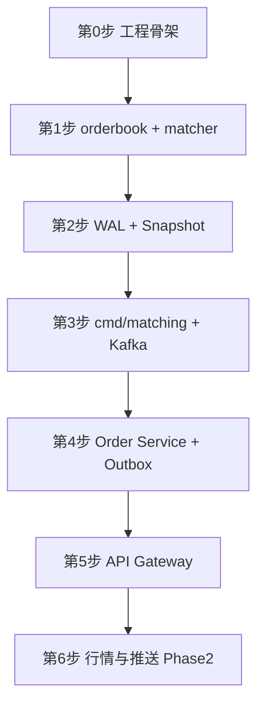

# 开发路线图（Go 学习向）

**版本**: 1.0  
**日期**: 2026-05-20  
**状态**: 草稿  
**关联**: [architecture-spec.md](./architecture-spec.md) · [rest-api.md](./rest-api.md)

本文档记录**自学 Go 前提下**实现本交易所服务集群的推荐顺序、每步验收标准与可推迟模块。与架构文档 [§8 分阶段落地路线](./architecture-spec.md#8-分阶段落地路线) 对齐，但对「先写什么代码」做了更适合初学者的微调。

---

## 1. 总体原则

| 原则 | 说明 |
|------|------|
| 先核心后外围 | 撮合引擎 → 订单服务 → 网关 → 行情推送 |
| 先纯 Go 后基础设施 | orderbook 单元测试不依赖 Kafka/PostgreSQL |
| 先单交易对 | 默认只实现 `BTC-USDT`，Phase 3 再做多分片 |
| 每步可验收 | 每阶段有明确「完成定义」，避免一次写完全部 |
| 测试驱动 | 撮合核心、WAL、Outbox 必须有测试；撮合核心目标覆盖率 ≥80% |

**不要从这里开始：**

- API Gateway（HTTP/JWT/限流组合过多）
- Kafka 全集群 + 全部微服务同时开工
- Market Data / Push / `ticker@all`（依赖成交事件，属 Phase 2）
- 上千 symbol、分片迁移（属 Phase 3）

---

## 2. 推荐开发顺序（总览）

```text
第 0 步   工程骨架 + 公共包
    ↓
第 1 步   撮合引擎核心（orderbook + matcher）     ← 建议第一行业务代码
    ↓
第 2 步   WAL + Snapshot（本地持久化）
    ↓
第 3 步   Matching Engine 进程（先本地命令，再接 Kafka）
    ↓
第 4 步   Order Service（PostgreSQL + Outbox + match.events）
    ↓
第 5 步   API Gateway（REST 薄封装）
    ↓
第 6 步   行情 / K 线 / WebSocket / ticker@all（Phase 2）
```



---

## 3. 分步说明

### 第 0 步：工程骨架（约 1～2 天）

**目标**：可编译、可测试的 monorepo，尚无业务逻辑。

**目录（最小集）**

```
trading_matchengine/
├── go.mod
├── Makefile
├── pkg/
│   └── logger/              # zerolog 或 zap
├── proto/
│   └── common/types.proto   # 可暂缓，先用 Go struct
├── internal/
│   └── matching/engine/     # 第 1 步使用
├── cmd/                     # 第 3 步起填充
├── migrations/              # 第 4 步起填充
└── docs/
```

**任务清单**

- [ ] `go mod init`，配置 Go 1.22+
- [ ] `Makefile`：`test`、`lint`（可选 golangci-lint）
- [ ] `pkg/logger` 结构化日志（含 `service`、`request_id` 字段占位）
- [ ] （可选）`docker compose`：PostgreSQL、Kafka、Redis，**前几周可不启动**

**验收**：`go test ./...` 通过（可为空测试）。

**本阶段 Go 技能**：module、package、`go test`、项目布局。

**仓库已预置（第 0 步骨架）**：若根目录已有 `go.mod`、`Makefile`、`pkg/logger`、`internal/matching/engine`，直接执行：

```bash
go mod tidy
make test
```

详见根目录 [README.md](../README.md)。

---

### 第 1 步：撮合引擎核心（优先，约 1～2 周）

**目标**：价格-时间优先撮合，**纯内存、无网络**。

**路径**：`internal/matching/engine/`

| 文件 | 职责 |
|------|------|
| `orderbook.go` | 买卖盘、`map[price]*PriceLevel`、FIFO 队列 |
| `matcher.go` | `LIMIT` 撮合、部分成交、挂单入簿 |
| `types.go` | `Order`、`Trade`、`Side` 等（proto 未就绪时先用 struct） |
| `matcher_test.go` | 表驱动测试 |

**任务清单**

- [ ] 限价买单吃掉卖盘，生成 `Trade`
- [ ] 无法成交时进入 Orderbook
- [ ] 撤单从盘口移除
- [ ] 最优买价 < 最优卖价（非空盘口时）断言

**验收标准**

1. `go test ./internal/matching/engine/... -cover` 覆盖率 ≥ **80%**
2. 测试场景：双卖单 + 一买单成交；价格不匹配则挂单；撤单后数量正确

**本阶段 Go 技能**：struct、map、slice、排序、表驱动测试、错误处理。

**参考架构**：§2.3 Matching Engine、§5.1 数据结构。

---

### 第 2 步：WAL + Snapshot（约 1 周）

**目标**：进程重启后盘口与订单状态可恢复。

**路径**

| 路径 | 职责 |
|------|------|
| `pkg/wal/` | 顺序写、CRC、`fsync` |
| `pkg/snapshot/` | 快照序列化（protobuf 或 gob，与架构一致建议 protobuf） |
| `internal/matching/recovery/` | 加载快照 → 回放 WAL → 校验 |

**任务清单**

- [ ] 状态变更前 **先写 WAL 再改内存**（架构约束 #11）
- [ ] 定期或按条数生成 Snapshot
- [ ] 重启恢复流程：manifest → snapshot → WAL replay（§5.5）
- [ ] 恢复后 checksum / 盘口合法性断言

**验收标准**

1. 下单 → 写 WAL → 杀进程 → 重启 → 挂单仍在
2. 已成交订单不会再次撮合（`order_id` 去重）

**本阶段 Go 技能**：文件 IO、`encoding/binary` / protobuf、临时目录测试。

**参考架构**：§5 撮合引擎恢复重启机制。

---

### 第 3 步：Matching Engine 进程（约 1～2 周）

**目标**：独立可运行服务，消费命令、发布成交事件。

**路径**

| 路径 | 职责 |
|------|------|
| `cmd/matching/main.go` | 入口、配置、优雅退出 |
| `internal/matching/consumer/` | 消费 `order.commands` |
| `internal/matching/publisher/` | 发布 `match.events`、`trade.events` |
| `pkg/kafka/` | producer/consumer 封装 |

**建议子顺序**

1. **本地喂命令**：stdin 或 JSON 文件 → engine（跳过 Kafka，快速联调）
2. 接入 Kafka：消费 `NewOrderCommand` / `CancelOrderCommand`
3. WAL fsync 成功后再 commit Kafka offset（§6.2）

**任务清单**

- [ ] `cmd/matching` 可启动
- [ ] 消费 Kafka 命令并撮合
- [ ] 发布 `match.events`、`trade.events`
- [ ] SIGTERM 优雅退出

**验收标准**（= 架构 Phase 1）

> 重启撮合引擎后，挂单不丢失，已成交订单不重复撮合。

**本阶段 Go 技能**：`main`、`context`、signal、sarama/kafka-go。

**基础设施**：此步起需要 `docker compose` 启动 Kafka（单节点开发版即可）。

---

### 第 4 步：Order Service（约 2 周）

**目标**：订单持久化、余额冻结、Outbox 投递、消费撮合回写。

**路径**

| 路径 | 职责 |
|------|------|
| `cmd/order/main.go` | gRPC 服务入口 |
| `internal/order/service/` | PlaceOrder、CancelOrder |
| `internal/order/repository/` | PostgreSQL |
| `internal/order/outbox/` | 同事务写入 + Relay |
| `internal/order/consumer/` | 消费 `match.events` |
| `migrations/` | orders、order_outbox、account_balances 等 |

**建议子顺序**

1. gRPC `PlaceOrder` + DB 写单（可先 **不写 Outbox**，直接发 Kafka 打通链路）
2. 改为 **Transactional Outbox**（§4.3）
3. 订单状态机（PENDING → ACCEPTED → PARTIAL / FILLED / CANCELED）
4. 消费 `match.events` 更新订单与余额
5. （可选）超时补偿 scheduler（§4.5）

**任务清单**

- [ ] `PlaceOrder` / `CancelOrder` gRPC
- [ ] 单事务：幂等 + 冻结 + orders + order_outbox
- [ ] Outbox Relay → `order.commands`
- [ ] 消费 `match.events`，幂等写 `trades`
- [ ] `client_order_id`（string）幂等；`order_id`（uint64）由 Order Service 发号

**验收标准**

1. gRPC 下单 → Matching 成交 → DB 订单为 `FILLED` 或 `PARTIAL`
2. 重复 `client_order_id` 返回同一 `order_id`
3. 撤单经 `CANCELING` → `CANCELED`

**联调工具**：`grpcurl` 或小型 Go gRPC 客户端（不必等 Gateway）。

**本阶段 Go 技能**：pgx/sql、事务、gRPC server、Kafka consumer。

**参考架构**：§4 一致性模型与补偿、§2.2 Order Service。

---

### 第 5 步：API Gateway（约 1 周）

**目标**：对外 REST，对内 gRPC；Phase 1 不做 WebSocket。

**路径**

| 路径 | 职责 |
|------|------|
| `cmd/gateway/main.go` | HTTP 服务 |
| `internal/gateway/handler/` | `POST/DELETE/GET /v1/orders` |
| `internal/gateway/client/` | Order Service gRPC 客户端 |
| `internal/gateway/middleware/` | JWT（可先硬编码 token）、`X-Request-Id` |

**任务清单**

- [ ] 实现 [rest-api.md](./rest-api.md) 中 Phase 1 订单接口
- [ ] JSON ↔ gRPC 转换
- [ ] 统一错误响应结构

**验收标准**

```bash
curl -X POST .../v1/orders   # 下单
curl .../v1/orders/{id}      # 查询，可见成交状态
```

**本阶段 Go 技能**：`net/http` 或 chi/gin、JSON、中间件链。

**参考**：[rest-api.md §3](./rest-api.md#3-订单命令order-service)

---

### 第 6 步：行情与推送（Phase 2，约 3～4 周）

**前置**：第 3 步已稳定发布 `trade.events` / `match.events`。

| 顺序 | 模块 | 说明 |
|------|------|------|
| 6.1 | Market Data Service | 深度、Ticker；写 Redis |
| 6.2 | Push Service + Gateway WS | `depth:`、`ticker:` 频道 |
| 6.3 | Kline Service | 消费 `trade.events` |
| 6.4 | Index Price Service | 外部交易所 HTTP |
| 6.5 | `ticker@all` | 做市商全市场；见 [rest-api.md §8.2](./rest-api.md#82-全市场-tickertickerall做市商) |

**验收标准**（架构 Phase 2）

> 客户端订阅 WS 后，实时收到深度/成交/K 线/指数价格。

---

## 4. 与架构 Phase 对照

| 本文档步骤 | architecture-spec Phase | 备注 |
|------------|-------------------------|------|
| 第 0～2 步 | Phase 1 前半 | 文档写「先 wal/snapshot」；学习路径将 **matcher 提前到 wal 之前** |
| 第 3～5 步 | Phase 1 后半 | 与 §8 Phase 1 验收一致 |
| 第 6 步 | Phase 2 | 行情与 K 线 |
| （未展开） | Phase 3 | 多分片、K8s、监控、对账告警 |
| （未展开） | Phase 4 | API Key HMAC、审计、压测 |

---

## 5. 明确推迟的模块

| 模块 | 阶段 | 原因 |
|------|------|------|
| API Gateway | 第 5 步 | 依赖 Order gRPC |
| Market Data / Push | 第 6 步 | 依赖 trade/match 事件 |
| Kline / Index Price | 第 6 步 | 不阻塞撮合主链路 |
| Shard Manager | Phase 3 | 先单 symbol |
| `ticker@all` 做市商通道 | 第 6.5 步 | 需 Market Data 预聚合 |
| Transactional Outbox 补偿 scheduler | 第 4 步可选 | 核心链路通后再加 |
| Protobuf 全量替换 | 第 3～4 步可渐进 | 可先用 struct + JSON 联调 |

---

## 6. 基础设施启用时机

| 组件 | 最早需要步骤 | 开发环境 |
|------|--------------|----------|
| 无 | 第 0～2 步 | 仅本地文件 |
| Kafka | 第 3 步 | docker compose 单节点 |
| PostgreSQL | 第 4 步 | docker compose |
| Redis | 第 4 步（幂等）/ 第 6 步（行情） | docker compose |

---

## 7. 学习与实践建议

1. **每个包先写 `*_test.go`**，用测试代替手动 `main` 验证。
2. **固定一个交易对** `BTC-USDT`，参数与 [rest-api.md](./rest-api.md) 示例一致。
3. **proto 可渐进**：第 1～2 步用 Go struct；第 3 步起引入 `proto/` + `gen-proto.sh`。
4. **每完成一步做一次端到端联调**，避免最后一周集中排障。
5. **阅读顺序**：`matcher_test.go` → `orderbook.go` → `pkg/wal` → `recovery` → `order/service`。
6. **文档同步**：行为变更时更新 architecture-spec / rest-api / 本文档验收项。

---

## 8. 检查清单（打印自用）

```
[ ] 第 0 步  go test ./... 通过
[ ] 第 1 步  matcher 覆盖率 ≥ 80%
[ ] 第 2 步  杀进程重启后盘口正确
[ ] 第 3 步  Kafka 下单 → 成交事件
[ ] 第 4 步  gRPC 下单 → DB 状态正确 + Outbox
[ ] 第 5 步  curl REST 全链路
[ ] 第 6 步  WS 收到 depth/ticker
```

---

## 9. 修订记录

| 版本 | 日期 | 说明 |
|------|------|------|
| 1.0 | 2026-05-20 | 初稿：Go 学习向开发顺序，对齐 architecture-spec Phase 1～2 |
