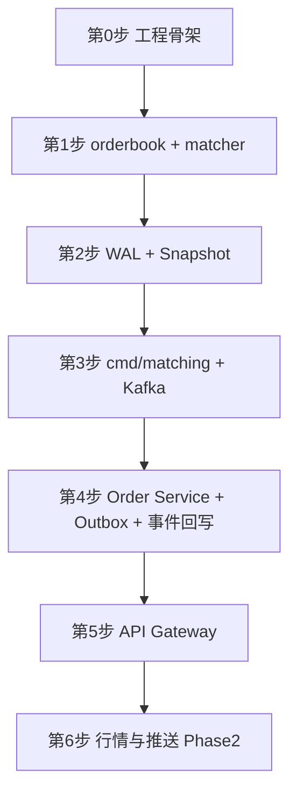

# 开发路线图（Go 学习向）

**版本**: 1.1  
**日期**: 2026-05-24  
**状态**: 草稿  
**关联**: [architecture-spec.md](./architecture-spec.md) · [rest-api.md](./rest-api.md)

本文档记录**自学 Go 前提下**实现本交易所服务集群的推荐顺序、每步验收标准与可推迟模块。与架构文档 [§8 分阶段落地路线](./architecture-spec.md#8-分阶段落地路线) 对齐，但对「先写什么代码」做了更适合初学者的微调。

---

## 1. 总体原则

| 原则 | 说明 |
|------|------|
| 先核心后外围 | 撮合引擎 → 订单服务 → 网关 → 行情推送 |
| 先纯 Go 后基础设施 | orderbook 单元测试不依赖 Kafka/PostgreSQL |
| 先单交易对 | 默认只实现 `BTC-USDT`，Phase 3 再做多分片 |
| 每步可验收 | 每阶段有明确「完成定义」，避免一次写完全部 |
| 测试驱动 | 撮合核心、WAL、Outbox 必须有测试；撮合核心目标覆盖率 ≥80% |

**不要从这里开始：**

- API Gateway（HTTP/JWT/限流组合过多）
- Kafka 全集群 + 全部微服务同时开工
- Market Data / Push / `ticker@all`（依赖成交事件，属 Phase 2）
- 上千 symbol、分片迁移（属 Phase 3）

---

## 2. 推荐开发顺序（总览）

```text
第 0 步   工程骨架 + 公共包
    ↓
第 1 步   撮合引擎核心（orderbook + matcher）     ← 建议第一行业务代码
    ↓
第 2 步   WAL + Snapshot（本地持久化）
    ↓
第 3 步   Matching Engine 进程（先本地命令，再接 Kafka）
    ↓
第 4 步   Order Service（PostgreSQL + Outbox + match/trade.events）
    ↓
第 5 步   API Gateway（REST 薄封装）
    ↓
第 6 步   行情 / K 线 / WebSocket / ticker@all（Phase 2）
```



---

## 3. 分步说明

### 第 0 步：工程骨架（约 1～2 天）

**目标**：可编译、可测试的 monorepo，尚无业务逻辑。

**目录（最小集）**

```
trading_matchengine/
├── go.mod
├── Makefile
├── pkg/
│   └── logger/              # zerolog 或 zap
├── proto/
│   └── common/types.proto   # 可暂缓，先用 Go struct
├── internal/
│   └── matching/engine/     # 第 1 步使用
├── cmd/                     # 第 3 步起填充
├── migrations/              # 第 4 步起填充
└── docs/
```

**任务清单**

- [ ] `go mod init`，配置 Go 1.22+
- [ ] `Makefile`：`test`、`lint`（可选 golangci-lint）
- [ ] `pkg/logger` 结构化日志（含 `service`、`request_id` 字段占位）
- [ ] （可选）`docker compose`：PostgreSQL、Kafka、Redis，**前几周可不启动**

**验收**：`go test ./...` 通过（可为空测试）。

**本阶段 Go 技能**：module、package、`go test`、项目布局。

**仓库已预置（第 0 步骨架）**：若根目录已有 `go.mod`、`Makefile`、`pkg/logger`、`internal/matching/engine`，直接执行：

```bash
go mod tidy
make test
```

详见根目录 [README.md](../README.md)。

---

### 第 1 步：撮合引擎核心（优先，约 1～2 周）

**目标**：价格-时间优先撮合，**纯内存、无网络**。

**路径**：`internal/matching/engine/`

| 文件 | 职责 |
|------|------|
| `orderbook.go` | 买卖盘、`map[price]*PriceLevel`、FIFO 队列 |
| `matcher.go` | `LIMIT` 撮合、部分成交、挂单入簿 |
| `types.go` | `Order`、`Trade`、`Side` 等（proto 未就绪时先用 struct） |
| `matcher_test.go` | 表驱动测试 |

**任务清单**

- [ ] 限价买单吃掉卖盘，生成 `Trade`
- [ ] 无法成交时进入 Orderbook
- [ ] 撤单从盘口移除
- [ ] 最优买价 < 最优卖价（非空盘口时）断言

**验收标准**

1. `go test ./internal/matching/engine/... -cover` 覆盖率 ≥ **80%**
2. 测试场景：双卖单 + 一买单成交；价格不匹配则挂单；撤单后数量正确

**本阶段 Go 技能**：struct、map、slice、排序、表驱动测试、错误处理。

**参考架构**：§2.3 Matching Engine、§5.1 数据结构。

---

### 第 2 步：WAL + Snapshot（约 1 周）

**目标**：进程重启后盘口与订单状态可恢复。

**路径**

| 路径 | 职责 |
|------|------|
| `pkg/wal/` | 顺序写、CRC、`fsync` |
| `pkg/snapshot/` | 快照序列化（protobuf 或 gob，与架构一致建议 protobuf） |
| `internal/matching/recovery/` | 加载快照 → 回放 WAL → 校验 |

**任务清单**

- [ ] 状态变更前 **先写 WAL 再改内存**（架构约束 #11）
- [ ] 定期或按条数生成 Snapshot
- [ ] 重启恢复流程：manifest → snapshot → WAL replay（§5.5）
- [ ] 恢复后 checksum / 盘口合法性断言

**验收标准**

1. 下单 → 写 WAL → 杀进程 → 重启 → 挂单仍在
2. 已成交订单不会再次撮合（`order_id` 去重）

**本阶段 Go 技能**：文件 IO、`encoding/binary` / protobuf、临时目录测试。

**参考架构**：§5 撮合引擎恢复重启机制。

---

### 第 3 步：Matching Engine 进程（约 1～2 周）

**接口说明**：[matching-api.md](./matching-api.md) · **调用链**：[matching-message-flow.md](./matching-message-flow.md)

**目标**：独立可运行服务，消费命令、发布成交事件。

**路径**

| 路径 | 职责 |
|------|------|
| `cmd/matching/main.go` | 入口、配置、优雅退出 |
| `internal/matching/consumer/` | 消费 `order.commands` |
| `internal/matching/publisher/` | 发布 `match.events`、`trade.events` |
| `pkg/kafka/` | producer/consumer 封装 |

**建议子顺序**

1. **本地喂命令**：stdin 或 JSON 文件 → engine（跳过 Kafka，快速联调）
2. 接入 Kafka：消费 `NewOrderCommand` / `CancelOrderCommand`
3. WAL fsync 成功后再 commit Kafka offset（§6.2）

**任务清单**

- [ ] `cmd/matching` 可启动
- [ ] 消费 Kafka 命令并撮合
- [ ] 发布 `match.events`、`trade.events`
- [ ] SIGTERM 优雅退出

**验收标准**（= 架构 Phase 1）

> 重启撮合引擎后，挂单不丢失，已成交订单不重复撮合。

**本阶段 Go 技能**：`main`、`context`、signal、sarama/kafka-go。

**基础设施**：此步起需要 `docker compose` 启动 Kafka（单节点开发版即可）。

---

### 第 4 步：Order Service（约 2 周）

**接口说明**：[order-api.md](./order-api.md) · [architecture-spec.md §4](./architecture-spec.md#4-一致性模型与补偿) · **Kafka 契约**：[matching-api.md](./matching-api.md)（与第 3 步 Matching 对齐）

**目标**：订单持久化、余额冻结、Outbox 投递、消费撮合回写（状态 + 成交）。

**路径**

| 路径 | 职责 |
|------|------|
| `cmd/order/main.go` | 进程入口、配置、优雅退出 |
| `proto/order/v1/order.proto`、`balance.proto` | gRPC：订单 + 资产 |
| `internal/order/config/` | DB、Kafka、gRPC 端口等配置 |
| `internal/order/handler/` | gRPC server 实现 |
| `internal/order/service/` | 下单/撤单/查询业务逻辑、状态机 |
| `internal/order/repository/` | PostgreSQL CRUD |
| `internal/order/outbox/` | 同事务写入 + Relay 投递 |
| `internal/order/consumer/` | 消费 `match.events`（状态）与 `trade.events`（成交） |
| `internal/order/reconciler/` | 超时补偿 scheduler（§4.5） |
| `configs/order.json` | 联调配置（对标 `matching.kafka.json`） |
| `migrations/` | 见下表 |
| `pkg/kafka/` | **复用**第 3 步已有封装（Outbox Relay + consumer） |
| `pkg/postgres/` | （可选）连接池、事务 helper |

**migrations（Phase 1 最小表集）**

| 表 | 用途 |
|----|------|
| `orders` | 订单主表（含 `status`、`version` 乐观锁） |
| `order_outbox` | Transactional Outbox |
| `client_order_idempotency` | `client_order_id` 唯一索引，下单幂等 |
| `account_balances` | 余额 + 冻结 |
| `trades` | 成交记录（`trade_id` 唯一约束幂等） |
| `processed_match_events` | match 事件幂等 |
| `balance_adjust_idempotency` | 调账幂等 |
| `007` 索引 | `ListOrders` 列表查询 |

**建议子顺序**

1. gRPC `PlaceOrder` + DB 写单（可先 **不写 Outbox**，直接发 Kafka 打通链路）
2. 改为 **Transactional Outbox**（§4.3）
3. 订单状态机完整迁移：
   - `PENDING` → `ACCEPTED`（`ORDER_ACCEPTED`）
   - → `PARTIAL` / `FILLED`（`ORDER_PARTIAL_FILLED` / `ORDER_FILLED`）
   - 撤单：`PENDING`/`ACCEPTED`/`PARTIAL` → `CANCELING` → `CANCELED`
4. 消费 **`match.events`** 更新订单状态（含 maker 侧被动成交流）
5. 消费 **`trade.events`** 幂等写 `trades` + 余额扣减/解冻
6. 实现 `GetOrder`（grpcurl 查单，供第 5 步 Gateway 复用）— **已完成**
7. （可选）超时补偿 scheduler（§4.5）、`ListOrders` — **已完成**（拒单时同步写 Cancel Outbox）

**Outbox → Kafka 契约（必须与 Matching 一致）**

- 消息体 = `proto.Marshal(OrderCommandEnvelope)`，**禁止**裸发 `NewOrderCommand`（见 [matching-api.md §4.1](./matching-api.md#41-顶层ordercommandenvelope)）
- `command_id` 建议用 `order_outbox.id`
- Kafka message key = `symbol`；Phase 1 开发环境固定 **partition 0**（与 `configs/matching.kafka.json` 一致）

**任务清单**

- [x] `PlaceOrder` / `CancelOrder` / `GetOrder` / `ListOrders` gRPC
- [x] `BalanceService`：`GetBalance` / `ListBalances` / `UpdateBalance`（联调充值）
- [x] 单事务：幂等 + 余额冻结 + `orders` INSERT + `order_outbox` INSERT
- [x] Outbox Relay → `order.commands`（`OrderCommandEnvelope` + `acks=all`）
- [x] 消费 `match.events`：按 `event_type` 更新 `orders.status`（含 `ACCEPTED`、fill-wins）
- [x] 消费 `trade.events`：按 `trade_id` 幂等写 `trades` + 更新 `account_balances`
- [x] `client_order_id`（string）幂等；`order_id`（uint64）由 Order Service 发号
- [x] 超时补偿 scheduler（`internal/order/reconciler`）
- [ ] Outbox / 状态机 **集成测试**（testcontainers 或等价 PG 集成测；当前以单元测试为主）

**第 4 步状态（代码）**：核心链路已实现，可进入第 5 步 Gateway；上线前建议跑通下方验收标准并补集成测试。

**验收标准**

1. gRPC 下单 → Matching 成交 → DB 订单为 `ACCEPTED` / `PARTIAL` / `FILLED`（视场景）
2. 重复 `client_order_id` 返回同一 `order_id`
3. 撤单经 `CANCELING` → `CANCELED`，剩余冻结已释放
4. `trade.events` 写入 `trades`，重复 `trade_id` 不重复扣款
5. Outbox Relay 重启后，未投递命令仍能发到 `order.commands`

**联调顺序**

```bash
docker compose -f deploy/docker-compose.yml up -d   # PG/Kafka 已在 compose 中
make migrate-up                                     # 或 golang-migrate
./scripts/kafka-create-topics.sh
./scripts/matching.sh start                         # 消费 order.commands
./bin/order -config configs/order.json            # 启动 Order Service
grpcurl -plaintext localhost:50051 order.v1.OrderService/PlaceOrder  # 完整示例见 order-api.md §3.2
grpcurl -plaintext localhost:50051 ... GetOrder     # 验证 status / filled_quantity
```

**联调工具**：`grpcurl` 或小型 Go gRPC 客户端（不必等 Gateway）。

**本阶段 Go 技能**：pgx/sql、事务、gRPC server、Kafka consumer/producer。

**参考架构**：§4 一致性模型与补偿、§2.2 Order Service。

---

### 第 5 步：API Gateway（约 1 周）

**目标**：对外 REST，对内 gRPC；Phase 1 不做 WebSocket。

**详细开发步骤**：[gateway-development-plan.md](./gateway-development-plan.md)（范围、分阶段任务、联调命令、DoD）。

**路径**

| 路径 | 职责 |
|------|------|
| `cmd/gateway/main.go` | HTTP 服务 |
| `internal/gateway/handler/` | `POST/DELETE/GET /v1/orders` |
| `internal/gateway/client/` | Order Service gRPC 客户端 |
| `internal/gateway/middleware/` | JWT（可先硬编码 token）、`X-Request-Id` |
| `internal/gateway/convert/` | JSON ↔ gRPC |
| `internal/gateway/response/` | 统一错误/成功信封 |
| `configs/gateway.json` | Gateway 配置 |

**任务清单（摘要，勾选以详细文档为准）**

- [x] 阶段 0～1：骨架、配置、`/v1/health`、`/v1/time`、中间件
- [ ] 阶段 2：`convert` + gRPC 错误 → REST
- [ ] 阶段 3：`POST/DELETE/GET /v1/orders`（含列表，见开发计划 §1.3）
- [ ] 阶段 4：单测 + 端到端联调
- [ ] 实现 [rest-api.md](./rest-api.md) Phase 1 订单接口语义
- [ ] JSON ↔ gRPC 转换；`order_id` 十进制字符串
- [ ] 统一错误响应结构

**验收标准**

```bash
curl -X POST .../v1/orders   # 下单
curl .../v1/orders/{id}      # 查询，可见成交状态
```

完整命令见 [gateway-development-plan.md §5](./gateway-development-plan.md#5-联调与验收)。

**本阶段 Go 技能**：`net/http` 或 chi/gin、JSON、中间件链。

**参考**：[rest-api.md §3](./rest-api.md#3-订单命令order-service) · [order-api.md](./order-api.md) · [gateway-development-plan.md](./gateway-development-plan.md)

---

### 第 6 步：行情与推送（Phase 2，约 3～4 周）

**前置**：第 3 步已稳定发布 `trade.events` / `match.events`。

| 顺序 | 模块 | 说明 |
|------|------|------|
| 6.1 | Market Data Service | 深度、Ticker；写 Redis；**供 Order 市价买单冻结查价**（见 [design/market-buy-freeze.md](./design/market-buy-freeze.md)） |
| 6.2 | Push Service + Gateway WS | `depth:`、`ticker:` 频道 |
| 6.3 | Kline Service | 消费 `trade.events` |
| 6.4 | Index Price Service | 外部交易所 HTTP |
| 6.5 | `ticker@all` | 做市商全市场；见 [rest-api.md §8.2](./rest-api.md#82-全市场-tickertickerall做市商) |

**验收标准**（架构 Phase 2）

> 客户端订阅 WS 后，实时收到深度/成交/K 线/指数价格。

---

## 4. 与架构 Phase 对照

| 本文档步骤 | architecture-spec Phase | 备注 |
|------------|-------------------------|------|
| 第 0～2 步 | Phase 1 前半 | 文档写「先 wal/snapshot」；学习路径将 **matcher 提前到 wal 之前** |
| 第 3～5 步 | Phase 1 后半 | 与 §8 Phase 1 验收一致 |
| 第 6 步 | Phase 2 | 行情与 K 线 |
| （未展开） | Phase 3 | 多分片、K8s、监控、对账告警 |
| （未展开） | Phase 4 | API Key HMAC、审计、压测 |

---

## 5. 明确推迟的模块

| 模块 | 阶段 | 原因 |
|------|------|------|
| API Gateway | 第 5 步 | 依赖 Order gRPC |
| 市价买单行情冻结（方案 C） | 第 6 步 6.1 之后 | 依赖 Market Data gRPC；见 [design/market-buy-freeze.md](./design/market-buy-freeze.md) |
| Market Data / Push | 第 6 步 | 依赖 trade/match 事件 |
| Kline / Index Price | 第 6 步 | 不阻塞撮合主链路 |
| Shard Manager | Phase 3 | 先单 symbol |
| `ticker@all` 做市商通道 | 第 6.5 步 | 需 Market Data 预聚合 |
| Matching 对账 API（§5.6） | Phase 2+ | scheduler 已发 Cancel，对账为兜底 |
| Redis 下单幂等缓存 | 第 4 步可选 | DB `client_order_idempotency` 唯一索引已足够 |
| Protobuf 全量替换 | 第 3～4 步可渐进 | 可先用 struct + JSON 联调 |

---

## 6. 基础设施启用时机

| 组件 | 最早需要步骤 | 开发环境 |
|------|--------------|----------|
| 无 | 第 0～2 步 | 仅本地文件 |
| Kafka | 第 3 步 | docker compose 单节点 |
| PostgreSQL | 第 4 步起**使用**（compose 第 3 步已含） | docker compose |
| Redis | 第 4 步可选（幂等缓存）/ 第 6 步（行情） | docker compose；Phase 1 幂等以 DB 唯一索引为准 |

---

## 7. 学习与实践建议

1. **每个包先写 `*_test.go`**，用测试代替手动 `main` 验证。
2. **固定一个交易对** `BTC-USDT`，参数与 [rest-api.md](./rest-api.md) 示例一致。
3. **proto 可渐进**：第 1～2 步用 Go struct；第 3 步起引入 `proto/` + `gen-proto.sh`。
4. **每完成一步做一次端到端联调**，避免最后一周集中排障。
5. **阅读顺序**：`matcher_test.go` → `orderbook.go` → `pkg/wal` → `recovery` → `matching-api.md` → `order/service`。
6. **文档同步**：行为变更时更新 architecture-spec / rest-api / 本文档验收项。

---

## 8. 检查清单（打印自用）

```
[ ] 第 0 步  go test ./... 通过
[ ] 第 1 步  matcher 覆盖率 ≥ 80%
[ ] 第 2 步  杀进程重启后盘口正确
[ ] 第 3 步  Kafka 下单 → 成交事件
[ ] 第 4 步  gRPC 下单 → DB 状态 + trades + Outbox
[ ] 第 5 步  curl REST 全链路
[ ] 第 6 步  WS 收到 depth/ticker
```

---

## 9. 修订记录

| 版本 | 日期 | 说明 |
|------|------|------|
| 1.1 | 2026-05-24 | 第 4 步对齐第 3 步 Kafka/protobuf 契约：补 trade.events、Outbox 格式、目录与验收项 |
| 1.0 | 2026-05-20 | 初稿：Go 学习向开发顺序，对齐 architecture-spec Phase 1～2 |
