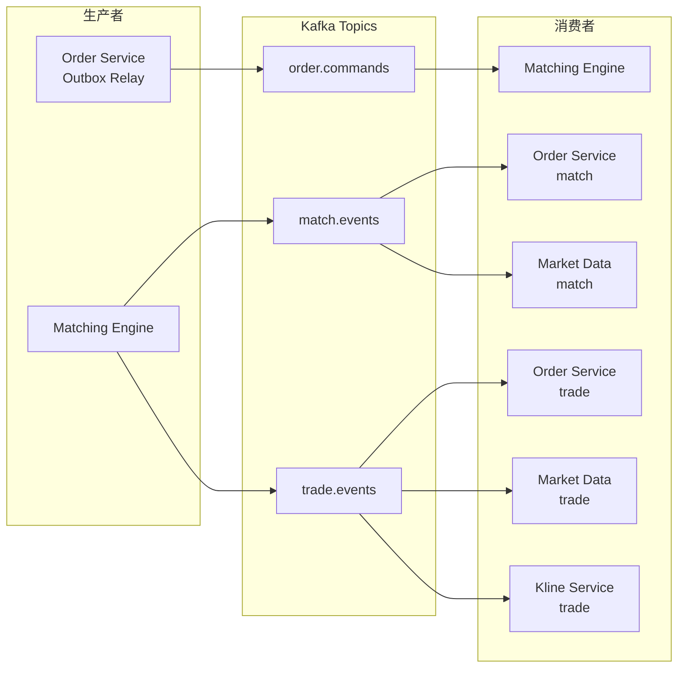
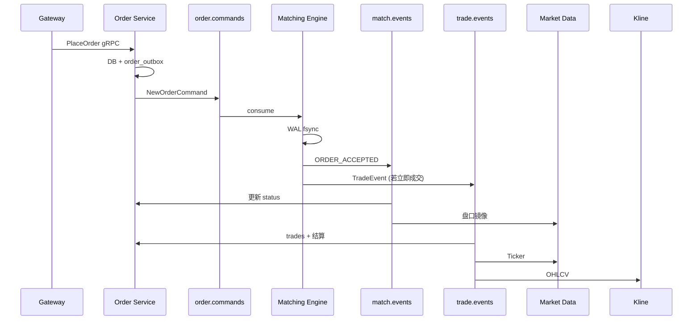

# Kafka 数据契约

**版本**: 1.0  
**日期**: 2026-05-29  
**状态**: 与当前仓库实现一致（Phase 1～2）  
**关联**: [architecture-spec.md](./architecture-spec.md) · [redis-data.md](./redis-data.md) · [matching-api.md](./matching-api.md) · [rest-api.md](./rest-api.md)

本文档描述交易所撮合链路中 **Kafka Topic、消息格式、生产者与消费者**。Proto 定义位于 `proto/matching/v1/`、`proto/common/v1/types.proto`。

---

## 1. 总览



**数据流（简）**

1. 用户下单/撤单 → Order 写 DB + `order_outbox` → Relay 投递 **`order.commands`**
2. Matching 消费命令 → WAL `fsync` → 发布 **`match.events`** / **`trade.events`**
3. Order 消费 match/trade 更新订单与余额；Market Data / Kline 消费行情相关事件

---

## 2. Topic 一览

| Topic | 实现状态 | 分区（开发） | 消息格式 | 主要生产者 | 主要消费者 |
|-------|----------|--------------|----------|------------|------------|
| `order.commands` | ✅ 已用 | 1 | `OrderCommandEnvelope` (protobuf) | Order Service（Outbox Relay） | Matching Engine |
| `match.events` | ✅ 已用 | 1 | `MatchEvent` (protobuf) | Matching Engine | Order Service、Market Data Service |
| `trade.events` | ✅ 已用 | 1 | `TradeEvent` (protobuf) | Matching Engine | Order Service、Market Data Service、Kline Service |
| `kline.raw` | ✅ 已用 | 1 | `KlineClosedEvent` (protobuf) | Kline Service | 下游（审计/风控等，待接） |
| `index.price` | ✅ | 1 | `IndexPriceEvent` (protobuf) | Index Price Service | 下游（合约标记价等，待接） |
| `system.audit` | 📋 规划 | — | — | 各服务 | 审计 |

开发环境创建 Topic：

```bash
./scripts/kafka-create-topics.sh
# 等价于创建 order.commands / match.events / trade.events / index.price / kline.raw，各 1 分区
```

生产目标（见 [architecture-spec.md §6.2](./architecture-spec.md#62-kafka事件总线)）：按 **symbol → shard → partition** 路由；`trade.events` 保留期更长、可多下游并行消费。

---

## 3. 通用约定

### 3.1 序列化

| 项 | 约定 |
|----|------|
| **Value** | **Protobuf 二进制**（`proto.Marshal`），不是 JSON |
| **Key** | UTF-8 字节，一般为 **`symbol`**（如 `BTC-USDT`） |
| **Headers** | 当前未使用业务 Header |

解码示例（需本地 `protoc` 与仓库 `proto/`）：

```bash
# 从 topic 拉一条二进制消息后
protoc --decode=matching.v1.TradeEvent \
  -I proto proto/matching/v1/events.proto < /tmp/msg.bin
```

### 3.2 分区与投递（当前 MVP）

| 组件 | 行为 |
|------|------|
| **Order Outbox Relay** | 写入配置中的固定 `partition`（默认 `0`）；`partition_key` 存 `symbol`，与后续按 symbol 分片兼容 |
| **Matching 发布** | `Producer.Write(topic, key=symbol, value=proto)` |
| **下游消费者** | 固定消费 `partition: 0`；`group_id` 各服务独立 |

配置文件中的 Topic 名默认均为：

- `order.commands` / `match.events` / `trade.events`

见：`configs/order.json`、`configs/matching.kafka.json`、`configs/marketdata.json`、`configs/kline.json`（`kline_raw_topic`、`producer_enabled`）。

### 3.3 Offset 提交

| 消费者 | 提交时机 |
|--------|----------|
| **Matching Engine** | 单条命令 WAL 落盘且 `match.events`/`trade.events` 发布成功后 `Commit`；重启从 WAL 记录的 `kafka_offset` 恢复 |
| **Order / Market Data / Kline** | `Process` 成功后再 `Commit`（`enable.auto.commit=false` 语义） |

### 3.4 Consumer Group（开发默认）

| 服务 | `group_id` | 消费 Topic |
|------|------------|------------|
| Matching Engine | `matching-shard-0` | `order.commands` |
| Order Service | `order-service` | `match.events`、`trade.events` |
| Market Data Service | `marketdata-service` | `match.events`、`trade.events` |
| Kline Service | `kline-service` | `trade.events` |

`consumer_start_offset: -1` 表示从 **最新** 开始（开发）；回放需改为 `0` 或指定 offset。

---

## 4. Topic：`order.commands`

### 4.1 职责

承载 **下单 / 撤单命令**，由 Order Service 经 **Transactional Outbox** 可靠投递，Matching Engine **唯一执行**。

### 4.2 生产者

| 生产者 | 模块 | 说明 |
|--------|------|------|
| **Order Service** | `internal/order/outbox/relay.go` | 轮询 `order_outbox`，`published_at IS NULL` 的行投递 Kafka |

**触发路径**

1. `POST /v1/orders`（Gateway）→ Order gRPC `PlaceOrder` → 事务内写 `orders` + `order_outbox`
2. `DELETE /v1/orders/{id}` → `BeginCancel` → 事务内写 `CANCELING` + outbox
3. Reconciler 超时重发撤单（再插 outbox）

**载荷构建**

| 事件类型 | `order_outbox.event_type` | Proto |
|----------|---------------------------|-------|
| 下单 | `NewOrderCommand` | `OrderCommandEnvelope.new_order` |
| 撤单 | `CancelOrderCommand` | `OrderCommandEnvelope.cancel_order` |

- 定义：`proto/matching/v1/envelope.proto`、`proto/matching/v1/commands.proto`
- 构建：`internal/order/outbox/envelope.go`、`cancel_envelope.go`
- **`command_id`** = `order_outbox.id`（全局递增）

### 4.3 消费者

| 消费者 | 模块 | 说明 |
|--------|------|------|
| **Matching Engine** | `internal/matching/consumer/handler.go` | 解码 `OrderCommandEnvelope` → `ApplyNewOrder` / `ApplyCancel` → 发布下游事件 |

### 4.4 消息体结构

**外层：`OrderCommandEnvelope`**

```protobuf
message OrderCommandEnvelope {
    oneof command {
        NewOrderCommand new_order = 1;
        CancelOrderCommand cancel_order = 2;
    }
}
```

**`NewOrderCommand`**

| 字段 | 类型 | 说明 |
|------|------|------|
| `command_id` | uint64 | 命令 ID（= outbox.id） |
| `order` | `common.v1.Order` | 订单快照 |
| `kafka_partition` | uint32 | 消费后由 Matching 回填 |
| `kafka_offset` | uint64 | 消费后由 Matching 回填 |

**`common.v1.Order` 主要字段**

| 字段 | 说明 |
|------|------|
| `order_id` | 系统订单号 |
| `client_order_id` | 客户端幂等 ID |
| `symbol` | 交易对，如 `BTC-USDT` |
| `side` | `SIDE_BUY` / `SIDE_SELL` |
| `type` | `ORDER_TYPE_LIMIT` / `ORDER_TYPE_MARKET` |
| `price` | `Decimal.value` 字符串，限价必填 |
| `quantity` / `remaining` | 下单数量（字符串十进制） |
| `create_time` / `update_time` | 时间戳 |

**`CancelOrderCommand`**

| 字段 | 说明 |
|------|------|
| `command_id` | 命令 ID |
| `symbol` | 交易对 |
| `order_id` | 待撤订单 ID |
| `kafka_partition` / `kafka_offset` | 消费后回填 |

### 4.5 逻辑示例（JSON 示意，实际为 protobuf）

下单命令（仅便于阅读，**不要**用 JSON 生产消息）：

```json
{
  "new_order": {
    "command_id": 1001,
    "order": {
      "order_id": 2000000001,
      "client_order_id": "demo-001",
      "symbol": "BTC-USDT",
      "side": "SIDE_BUY",
      "type": "ORDER_TYPE_LIMIT",
      "price": { "value": "65000" },
      "quantity": { "value": "0.01" },
      "remaining": { "value": "0.01" }
    }
  }
}
```

---

## 5. Topic：`match.events`

### 5.1 职责

订单 **状态变更** 通知（接单、部成、全成、已撤），驱动 Order 更新 `orders.status`，Market Data 维护 **订单簿镜像**（挂单/撤单/成交移除）。

### 5.2 生产者

| 生产者 | 模块 | 说明 |
|--------|------|------|
| **Matching Engine** | `internal/matching/publisher/publisher.go` | 每条命令处理完成后，批量 `proto.Marshal(MatchEvent)` 写入本 Topic |

**事件生成**：`internal/matching/publisher/events.go`

| 场景 | 典型 `MatchEventType` | 说明 |
|------|----------------------|------|
| 新单入簿 | `ORDER_ACCEPTED` | 针对 taker 订单 |
| 发生成交 | `ORDER_PARTIAL_FILLED` / `ORDER_FILLED` | taker 与每个 maker 各一条 |
| 撤单成功 | `ORDER_CANCELED` | |

重复命令（WAL 幂等命中）**不重复发布**。

### 5.3 消费者

| 消费者 | 模块 | 处理逻辑 |
|--------|------|----------|
| **Order Service** | `internal/order/consumer/match_handler.go` | 更新 `orders.status`、`filled_quantity`；撤单释放冻结 |
| **Market Data Service** | `internal/marketdata/consumer/match_handler.go` | `ORDER_ACCEPTED` 写入盘口镜像；`FILLED`/`CANCELED` 移除档位 |

### 5.4 消息体：`MatchEvent`

定义：`proto/matching/v1/events.proto`

```protobuf
message MatchEvent {
    uint64 command_id = 1;
    string symbol = 2;
    uint64 order_id = 3;
    MatchEventType event_type = 4;
    common.v1.Order order = 5;   // 可选，含 quantity/remaining 供回写
    uint64 wal_seq = 6;
}

enum MatchEventType {
    ORDER_ACCEPTED = 1;
    ORDER_FILLED = 2;
    ORDER_PARTIAL_FILLED = 3;
    ORDER_CANCELED = 4;
}
```

| 字段 | 说明 |
|------|------|
| `command_id` | 关联 `order.commands` 中的 `command_id` |
| `order_id` | 本条事件对应的订单 |
| `event_type` | 状态枚举 |
| `order` | 订单快照；部成/全成时用于计算 `filled_quantity` |
| `wal_seq` | Matching WAL 序号，排查与幂等用 |

**注意**：一笔撮合成交会对 **taker + 每个 maker** 各发一条 `MatchEvent`；Order 需按 `order_id` 幂等更新。

---

## 6. Topic：`trade.events`

### 6.1 职责

**成交事实** 广播：价格、数量、买卖双方订单号。用于落库 `trades`、结算余额、更新 Ticker、聚合 K 线。

### 6.2 生产者

| 生产者 | 模块 | 说明 |
|--------|------|------|
| **Matching Engine** | `internal/matching/publisher/publisher.go` | 每笔 `engine.Trade` 对应一条 `TradeEvent` |

### 6.3 消费者

| 消费者 | 模块 | 处理逻辑 |
|--------|------|----------|
| **Order Service** | `internal/order/consumer/trade_handler.go` | `INSERT trades`（`trade_id` 唯一）；按成交结算冻结/余额 |
| **Market Data Service** | `internal/marketdata/consumer/trade_handler.go` | 更新内存 Ticker → Redis `ticker:{symbol}` + Pub/Sub |
| **Kline Service** | `internal/kline/consumer/trade_handler.go` | 内存 OHLCV 聚合 → Redis / PostgreSQL / Pub/Sub |

共享解码：`pkg/tradeevent/parse.go`（从 `TradeEvent` 提取 symbol、price、quantity、时间）。

### 6.4 消息体：`TradeEvent`

```protobuf
message TradeEvent {
    common.v1.Trade trade = 1;
    uint64 wal_seq = 2;
}
```

**`common.v1.Trade`**

| 字段 | 说明 |
|------|------|
| `trade_id` | 成交 ID（全局唯一，幂等键） |
| `symbol` | 交易对 |
| `price` / `quantity` | `Decimal.value` 字符串 |
| `maker_order_id` / `taker_order_id` | 双方订单号 |
| `create_time` | 成交时间（K 线桶对齐用；缺省则用消费时间） |

逻辑示例：

```json
{
  "trade": {
    "trade_id": 9000000001,
    "symbol": "BTC-USDT",
    "price": { "value": "65000" },
    "quantity": { "value": "0.01" },
    "maker_order_id": 2000000002,
    "taker_order_id": 2000000001
  },
  "wal_seq": 128
}
```

---

## 7. 端到端时序（限价撮合）



---

## 8. 规划 Topic（未实现）

以下在 [architecture-spec.md](./architecture-spec.md) 中已规划，**当前代码未生产/消费**：

| Topic | 用途 |
|-------|------|
| `system.audit` | 跨服务审计日志 |

### 8.1 `kline.raw`（已实现）

| 项 | 说明 |
|----|------|
| **生产者** | Kline Service，bar 落库并 Redis 闭合推送成功后发布 |
| **消息体** | `kline.v1.KlineClosedEvent`（protobuf） |
| **Key** | `symbol` |
| **输入** | Kline 仍消费 `trade.events` 做 OHLCV 聚合；`kline.raw` 仅为闭合通知，非成交流 |

解码示例：

```bash
protoc --decode=kline.v1.KlineClosedEvent \
  -I proto proto/kline/v1/kline.proto < /tmp/kline_raw.bin
```

---

## 9. 运维与排查

### 9.1 常用命令

```bash
# 列出 topic
docker exec -it kafka /opt/kafka/bin/kafka-topics.sh \
  --bootstrap-server localhost:9092 --list

# 消费 order.commands 最新消息（开发）
docker exec -it kafka /opt/kafka/bin/kafka-console-consumer.sh \
  --bootstrap-server localhost:9092 \
  --topic order.commands --from-beginning --max-messages 1

# 查看 consumer group lag（若使用 group 模式）
docker exec -it kafka /opt/kafka/bin/kafka-consumer-groups.sh \
  --bootstrap-server localhost:9092 \
  --describe --group order-service
```

### 9.2 联调检查清单

| 现象 | 排查 |
|------|------|
| 下单无撮合 | Order Outbox 是否 `published_at`；Matching 是否消费 `order.commands`；WAL 是否报错 |
| 订单一直 PENDING | `match.events` 是否被 Order 消费；`group_id` / offset 是否从 latest 起跳过了历史 |
| 有成交无 K 线 | `kline` 进程与 `trade.events` 消费；`consumer_start_offset` 是否为 `-1` 导致旧成交被跳过 |
| 有成交无 Ticker | `marketdata` 是否运行；Redis 是否可达 |

### 9.3 幂等与顺序

| Topic | 幂等建议 |
|-------|----------|
| `order.commands` | Matching WAL 按 `(command_id)` / 订单去重；重复投递不重复撮合 |
| `match.events` | Order 按 `(order_id, event_type, wal_seq)` 或状态机乐观更新 |
| `trade.events` | Order `trade_id` 唯一约束；Kline 按 bar 时间桶聚合 |

**同一 symbol 内** 由 Matching **单线程串行** 保证命令顺序；跨 symbol 分片后各 partition 内有序。

---

## 10. 配置索引

| 服务 | 配置文件 | Kafka 相关字段 |
|------|----------|----------------|
| Order | `configs/order.json` | `command_topic`, `match_topic`, `trade_topic`, `group_id`, `partition` |
| Matching | `configs/matching.kafka.json` | `command_topic`, `match_topic`, `trade_topic`, `group_id`, `partition` |
| Market Data | `configs/marketdata.json` | `match_topic`, `trade_topic`, `group_id`, `partition` |
| Kline | `configs/kline.json` | `trade_topic`, `group_id`, `partition` |

---

## 11. 修订记录

| 版本 | 日期 | 说明 |
|------|------|------|
| 1.0 | 2026-05-29 | 初版：三 Topic 契约、生产/消费矩阵、Proto 字段说明 |
