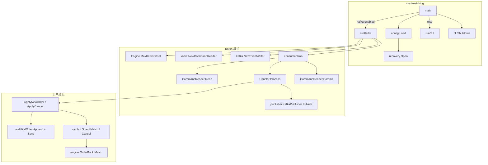
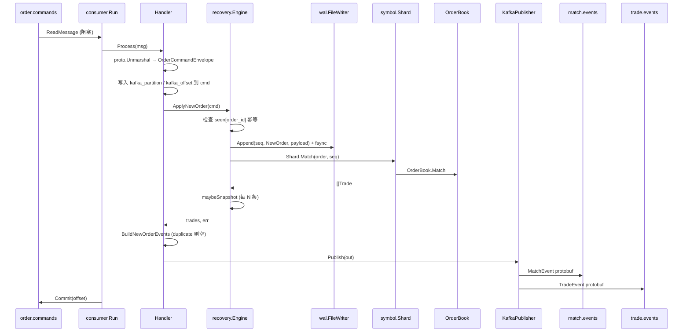

# Matching 服务消息处理流程

**版本**: 1.0  
**日期**: 2026-05-22  
**关联**: [development-roadmap.md](./development-roadmap.md) 第 3 步 · [architecture-spec.md](./architecture-spec.md)

本文描述 `cmd/matching` 进程从启动到处理一条命令的完整路径，包括函数调用关系与各层职责。

---

## 1. 总览

Matching 进程是**单分片、串行**处理命令：同一时刻只处理一条命令，保证 WAL 顺序与撮合确定性。

支持两种输入模式（由配置 `kafka.enabled` 切换）：

| 模式 | 配置 | 命令来源 | 结果输出 |
|------|------|----------|----------|
| **JSONL（3.1）** | `kafka.enabled=false` | stdin / 文件 | stdout JSON |
| **Kafka（3.2）** | `kafka.enabled=true` | `order.commands` | `match.events` / `trade.events` |

核心持久化与撮合栈对所有模式共用：

```text
recovery.Engine  →  WAL（先 fsync）→  symbol.Shard  →  engine.OrderBook.Match
```



---

## 2. 启动阶段

### 2.1 调用链

```text
main()
  ├─ config.Load(path)              // 读 JSON 配置、校验、默认值
  ├─ logger.New(...)                // 结构化日志
  ├─ recovery.Open(recovery.Config)
  │    ├─ wal.OpenFileWriter        // data/wal/{shard_id}/
  │    ├─ wal.OpenFileReader
  │    └─ Engine.recover()          // 见 §6
  ├─ signal.NotifyContext           // SIGINT/SIGTERM → 取消 ctx
  ├─ runKafka(ctx, ...) 或 runCLI(ctx, ...)
  └─ cli.Shutdown(eng, snapshotOnExit)
       ├─ eng.SnapshotNow()         // 可选
       └─ eng.Close()               // 关闭 WAL
```

### 2.2 关键函数

| 函数 | 包 | 作用 |
|------|-----|------|
| `config.Load` | `internal/matching/config` | 加载 `data_dir`、`shard_id`、`kafka.*`、`log.*` 等 |
| `recovery.Open` | `internal/matching/recovery` | 创建 `Engine`、打开 WAL、**启动时恢复**内存盘口 |
| `recovery.Engine.MaxKafkaOffset` | recovery | 扫描 WAL 中已记录的 Kafka offset，用于续消费 |
| `consumer.StartOffset` | `internal/matching/consumer` | `resume+1` 或从最新（`-1`） |

---

## 3. Kafka 模式：单条消息完整流程

### 3.1 时序（下单 `NewOrderCommand`）



### 3.2 消费循环

```text
consumer.Run(ctx, reader, handler)
  loop:
    ├─ select ctx.Done() → return（优雅退出）
    ├─ reader.Read(ctx)                    // pkg/kafka/CommandReader → kafka-go ReadMessage
    ├─ handler.Process(ctx, msg)
    └─ reader.Commit(ctx, msg)             // 仅 Process 成功才提交 offset
```

**约束（路线图 §6.2）**：`Commit` 发生在 `ApplyNewOrder`/`ApplyCancel` 内部的 `wal.Append`（含 `fsync`）成功之后；若 `Publish` 失败，不会 `Commit`，消息会重投。

### 3.3 Handler 层

| 函数 | 作用 |
|------|------|
| `Handler.Process` | 解码 `OrderCommandEnvelope`，分发到 new_order / cancel_order |
| `Handler.processNewOrder` | 填 Kafka 位点 → `ApplyNewOrder` → 判断是否 duplicate → `BuildNewOrderEvents` → `Publish` |
| `Handler.processCancel` | 填 Kafka 位点 → `ApplyCancel` → `BuildCancelEvents` → `Publish` |

**duplicate 判定**：`ApplyNewOrder` 前 `before := eng.LastSeq()`，若返回后 `LastSeq() == before`，表示未写 WAL（重复 `order_id`），不发布事件，但仍会 `Commit`（该 Kafka 消息视为已消费）。

### 3.4 事件构建与发布

| 函数 | 作用 |
|------|------|
| `publisher.BuildNewOrderEvents` | 生成 `ORDER_ACCEPTED`、每笔成交的 `TradeEvent`、maker/taker 的 `FILLED`/`PARTIAL_FILLED` |
| `publisher.BuildCancelEvents` | 生成 `ORDER_CANCELED` |
| `publisher.KafkaPublisher.Publish` | 序列化 protobuf，写入 `match_topic` / `trade_topic`（key=symbol） |
| `kafka.EventWriter.Write` | kafka-go Writer，`RequiredAcks=RequireAll` |

---

## 4. recovery.Engine：命令落盘与撮合

### 4.1 ApplyNewOrder

```text
Engine.ApplyNewOrder(cmd *NewOrderCommand)
  ├─ [幂等] seen[order_id] 已存在 → return nil, nil（不写 WAL）
  ├─ proto.Marshal(cmd) → WAL payload（含 kafka_partition/offset）
  ├─ wal.Append(seq, EventTypeNewOrder, payload)
  │    └─ Write + file.Sync()（fsync）
  ├─ applyNewOrder(cmd, seq)
  │    ├─ engine.OrderFromProto(cmd.Order)
  │    └─ shard.Match(order, seq)
  │         └─ SymbolEngine.Match → OrderBook.Match
  ├─ seen[order_id] = struct{}{}
  ├─ recovered = seq
  └─ maybeSnapshot(seq)   // seq % SnapshotEvery == 0 时写快照
```

### 4.2 ApplyCancel

```text
Engine.ApplyCancel(cmd *CancelOrderCommand)
  ├─ proto.Marshal(cmd)
  ├─ wal.Append(seq, EventTypeCancelOrder, payload) + fsync
  ├─ shard.Cancel(symbol, order_id)   // 盘口移除，不存在则幂等
  ├─ recovered = seq
  └─ maybeSnapshot(seq)
```

### 4.3 撮合内核（engine）

| 函数 | 作用 |
|------|------|
| `engine.OrderFromProto` | `common.v1.Order` → 内存 `engine.Order` |
| `OrderBook.Match` | 限价/市价撮合，价格-时间优先，返回 `[]Trade` |
| `engine.DeriveTradeID` | 由 `commandSeq + maker_id + taker_id` 确定性生成 `trade_id` |
| `OrderBook.InsertOrder` / `RemoveOrder` | 挂单入簿 / 撤单 |

---

## 5. JSONL 模式（3.1，无 Kafka）

```text
runCLI → cli.Run
  loop:
    ├─ HandleLine(eng, jsonLine, defaultSymbol)
    │    └─ HandleCommand
    │         ├─ new_order  → handleNewOrder
    │         │    ├─ 构造 engine.Order + recovery.NewOrderFromEngine
    │         │    └─ eng.ApplyNewOrder(pbCmd)   // 与 Kafka 共用 recovery 路径
    │         ├─ cancel_order → handleCancel → eng.ApplyCancel
    │         ├─ snapshot → eng.SnapshotNow
    │         └─ status → 读 OrderBook 状态写 JSON Response
    └─ WriteResponse(stdout)
```

**与 Kafka 模式的差异**：

- 不经过 `consumer` / `publisher`
- 不向 Kafka 发 `match.events` / `trade.events`
- WAL payload 里 `kafka_partition` / `kafka_offset` 通常为 0
- 结果以 JSON 行打印到 stdout

---

## 6. 启动恢复（recovery.recover）

进程每次 `recovery.Open` 时执行，**不消费 Kafka、不重发事件**：

```text
Engine.recover()
  ├─ loadSnapshots()
  │    ├─ snapshot.LoadManifest(manifest.pb)
  │    └─ 各 symbol 目录 snapshot.Load → restoreSymbol → OrderBook.RestoreFromSnapshot
  ├─ buildSeenFromWAL()           // 扫描全量 WAL，填充 seen[order_id]
  └─ replayWAL(fromSeq)           // 从 snapshot 位点之后回放
       └─ applyRecord(rec)        // 重放 NewOrder/Cancel，不发布 Kafka
```

| 函数 | 作用 |
|------|------|
| `loadSnapshots` | 从 `data/snapshots/{shard_id}/` 恢复盘口 |
| `replayWAL` | 应用 snapshot 之后的增量 WAL |
| `applyRecord` | 解码 WAL 记录，幂等重放撮合（`seq <= snapshotSeq` 跳过） |
| `Engine.MaxKafkaOffset` | 供 Kafka 模式计算 `StartOffset` |

---

## 7. 撤单消息流程（Kafka）

与下单类似，区别在 Handler 与事件类型：

```text
Process → processCancel
  → ApplyCancel（WAL Cancel + shard.Cancel）
  → BuildCancelEvents → ORDER_CANCELED
  → Publish → Commit
```

---

## 8. 包与文件索引

| 路径 | 职责 |
|------|------|
| `cmd/matching/main.go` | 入口、模式分支、信号、Shutdown |
| `internal/matching/config/` | 配置加载与校验 |
| `internal/matching/consumer/` | Kafka 消费循环、Handler、offset 提交策略 |
| `internal/matching/publisher/` | 事件组装与 Kafka 发布 |
| `internal/matching/recovery/` | WAL 先于内存、恢复、快照、`Apply*` API |
| `internal/matching/symbol/` | 多交易对路由 `Shard` / `SymbolEngine` |
| `internal/matching/engine/` | 订单簿、撮合算法、proto 转换 |
| `internal/matching/cli/` | JSONL 本地调试入口 |
| `pkg/kafka/` | kafka-go 读写封装 |
| `pkg/wal/` | 顺序日志、CRC、segment、fsync |
| `pkg/snapshot/` | 快照读写、manifest |
| `proto/matching/v1/` | `OrderCommandEnvelope`、`MatchEvent`、`TradeEvent` |

---

## 9. 消息格式

### 9.1 入站：`order.commands`

单条消息体为 protobuf `OrderCommandEnvelope`：

```protobuf
oneof command {
    NewOrderCommand new_order = 1;
    CancelOrderCommand cancel_order = 2;
}
```

命令内可携带 `kafka_partition`、`kafka_offset`（由 Handler 写入，并持久化进 WAL）。

### 9.2 出站

| Topic | 消息类型 | 典型事件 |
|-------|----------|----------|
| `match.events` | `MatchEvent` | `ORDER_ACCEPTED`、`ORDER_PARTIAL_FILLED`、`ORDER_FILLED`、`ORDER_CANCELED` |
| `trade.events` | `TradeEvent` | 每笔成交的 `common.v1.Trade` |

---

## 10. 错误与重试语义

| 阶段失败 | offset 是否提交 | 内存/WAL 状态 |
|----------|-----------------|---------------|
| `proto.Unmarshal` 失败 | 否 | 不变 |
| `wal.Append` / fsync 失败 | 否 | 不变 |
| 撮合 `Match` 返回 error | 否 | WAL 已写入（需注意重放；当前会阻断 Commit） |
| `Publish` 失败 | 否 | WAL + 内存已更新；重投时 duplicate 可能不再发事件 |
| 全部成功 | 是 | 一致 |

---

## 11. 相关配置示例

- 本地 JSONL：`configs/matching.json`（`kafka.enabled` 未设置或为 `false`）
- Kafka：`configs/matching.kafka.json`

---

## 修订记录

| 版本 | 日期 | 说明 |
|------|------|------|
| 1.0 | 2026-05-22 | 初稿：Kafka + JSONL 双模式、调用链与恢复流程 |
