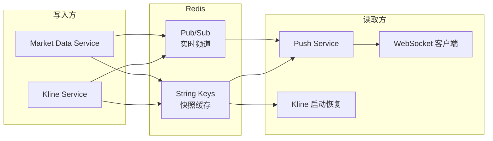
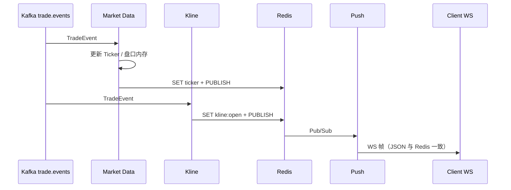

# Redis 数据契约

**版本**: 1.0  
**日期**: 2026-05-29  
**状态**: 与当前仓库实现一致（Phase 2 行情/推送）  
**关联**: [architecture-spec.md](./architecture-spec.md) · [kafka-data.md](./kafka-data.md) · [rest-api.md](./rest-api.md) §8

本文档描述 **Redis Key、Pub/Sub 频道、JSON 载荷、写入方与读取方**。开发环境通常使用单实例 `localhost:6379`，各服务默认 **DB 0**（见各 `configs/*.json`）。

---

## 1. 总览

Redis 在本项目中承担两类职责：

| 类型 | 用途 | 是否持久化业务真相 |
|------|------|-------------------|
| **String Key** | 行情快照、K 线 open bar、服务心跳 | 否（缓存/恢复辅助）；订单与成交真相在 PostgreSQL + Kafka |
| **Pub/Sub** | 实时推送到 WebSocket 客户端 | 否（允许丢消息，客户端靠订阅后 snapshot + 增量） |



**与 Kafka 的分工**：撮合结果经 **Kafka** 进入 Market Data / Kline；二者在内存聚合后，将 **对外可见的实时状态** 刷入 Redis，再由 **Push** 扇出到 WS。

---

## 2. 一览表

### 2.1 String Key（缓存）

| Key 模式 | 实现状态 | 值格式 | TTL（当前代码） | 写入方 | 读取方 |
|----------|----------|--------|-----------------|--------|--------|
| `ticker:{symbol}` | ✅ | JSON | 无（0=不过期） | Market Data | Push WS 订阅快照、运维 |
| `depth:{symbol}` | ✅ | JSON | 无 | Market Data | Push WS 订阅快照 |
| `ticker:all:{quote}` | ✅ | JSON | 无 | Market Data | Push WS（`ticker@all:{quote}` 映射） |
| `kline:open:{symbol}:{interval}` | ✅ | JSON | `interval + 1min` | Kline Service | Kline 启动恢复、Push（若订阅） |
| `kline:pending:close` | ✅ | LIST（JSON 元素） | 无 | Kline Service | Kline Worker 消费 |
| `svc:heartbeat:{service}` | ✅ | 毫秒时间戳字符串 | 10s | Market Data（预留 API） | 监控/探活 |
| `idempotent:order:{user_id}:{client_order_id}` | ✅ | order_id 十进制字符串 | 24h（可配置） | Order Service | PlaceOrder 幂等热路径；权威仍在 PG |
| `index:{symbol}` | ✅ | JSON | 10s | Index Price | Push WS、gRPC |

`{symbol}` 示例：`BTC-USDT`。`{interval}` 示例：`1m`、`1s`、`1h`（见 `pkg/kline/interval`）。  
`{quote}` 示例：`USDT`、`ALL`。

### 2.2 Pub/Sub 频道

| 频道模式 | 实现状态 | 载荷 | 发布方 | 订阅方 |
|----------|----------|------|--------|--------|
| `ticker:{symbol}` | ✅ | 同 `ticker:{symbol}` Key 的 JSON | Market Data | Push → WS |
| `depth:{symbol}` | ✅ | 深度 snapshot 或 delta JSON | Market Data | Push → WS |
| `ticker@all:{quote}` | ✅ | 同 `ticker:all:{quote}` Key | Market Data | Push → WS |
| `kline:{symbol}:{interval}` | ✅ | K 线 bar JSON | Kline Service | Push → WS |
| `trade:{symbol}` | ✅ | JSON | Market Data | Push 已 PSubscribe |
| `index:{symbol}` | ✅ | 同 Key JSON | Index Price | Push → WS |

Push 使用 **模式订阅**（`PSubscribe`）：`depth:*`、`ticker:*`、`trade:*`、`kline:*`、`index:*`、`ticker@all:*`、`order:*`（见 `internal/push/subscriber/redis_subscriber.go`）。

---

## 3. 通用约定

### 3.1 序列化

| 项 | 约定 |
|----|------|
| **编码** | **UTF-8 JSON**（非 Protobuf） |
| **价格/数量** | 十进制 **字符串**，避免浮点误差 |
| **时间** | 业务字段多用 **`ts` / `open_time_ms`：Unix 毫秒** |

### 3.2 快照 + 推送双写

行情类 Key 的典型写入顺序（Market Data / Kline）：

1. `SET key json [ttl]`
2. `PUBLISH channel json`（channel 与 key 同名或 `ticker@all:` 映射）

Pub/Sub **不保证可靠投递**；客户端应：

1. WebSocket `subscribe` 后，Push 从 Redis **GET 对应 Key** 发一帧快照（若存在）
2. 再接收 Pub/Sub 扇出的增量

### 3.3 共享封装

| 模块 | 说明 |
|------|------|
| `pkg/redis` | `Set` / `Get` / `Publish` / `PSubscribe` / `LPush` / `RPop` / `ScanKeys` / `Del` |
| `internal/marketdata/publisher` | 行情 JSON 与发布 |
| `internal/kline/publisher` | K 线 JSON、open bar、pending 队列 |

---

## 4. 行情：Ticker

### 4.1 Key / Channel

| 项 | 值 |
|----|-----|
| Key | `ticker:{symbol}` |
| Pub/Sub | `ticker:{symbol}`（与 Key 相同） |
| 触发 | 每笔 `trade.events` 成交后更新（`TradeHandler`） |

### 4.2 JSON 结构

定义：`internal/marketdata/publisher/redis_publisher.go` → `tickerJSON`

```json
{
  "symbol": "BTC-USDT",
  "last_price": "65000.50",
  "open_price": "64000",
  "high_price": "66000",
  "low_price": "63500",
  "volume": "1.234",
  "quote_volume": "80234.56",
  "price_change_percent": "1.56",
  "ts": 1716192000123
}
```

| 字段 | 说明 |
|------|------|
| `last_price` | 最新成交价 |
| `open_price` | 24h 开盘价（窗口内首笔成交价） |
| `high_price` | 24h 最高价 |
| `low_price` | 24h 最低价 |
| `volume` | 24h 成交量（base，滚动窗口内聚合） |
| `quote_volume` | 24h 成交额（quote） |
| `price_change_percent` | 24h 涨跌幅 `(last-open)/open*100`，保留 2 位小数 |
| `ts` | 更新时间（Unix ms） |

### 4.3 生产与消费

| 角色 | 组件 |
|------|------|
| **生产** | `internal/marketdata/consumer/trade_handler.go` → `PublishTicker` |
| **消费（WS）** | Push `subscribe` `ticker:BTC-USDT` → GET `ticker:BTC-USDT` + 后续 Pub/Sub |
| **消费（REST）** | Gateway → Market Data gRPC（**不读 Redis**，读服务内存） |

---

## 5. 行情：深度 Order Book

### 5.1 Key / Channel

| 项 | 值 |
|----|-----|
| Key | `depth:{symbol}` |
| Pub/Sub | `depth:{symbol}` |
| 触发 | 定时任务（默认 **100ms**，`publish.depth_interval_ms`） |

### 5.2 JSON 结构

```json
{
  "type": "snapshot",
  "symbol": "BTC-USDT",
  "last_update_id": 10293485721,
  "bids": [["65000.00", "1.5"], ["64999.50", "0.8"]],
  "asks": [["65001.00", "2.1"], ["65002.00", "0.3"]],
  "ts": 1716192000123
}
```

| 字段 | 说明 |
|------|------|
| `type` | `snapshot`：全量快照；`delta`：**仅 Pub/Sub**，变更价位 |
| `bids` / `asks` | `[价格, 数量]` 字符串数组 |
| `last_update_id` | 与内存 orderbook 版本对齐 |

**delta 行为（当前实现）**

- 每个 symbol **首次**发布：`type=snapshot`，**SET + PUBLISH**
- 之后仅价位变化：`type=delta`，**仅 PUBLISH**（不更新 Key）
- 故 WS 订阅时 GET 到的 Key 可能是较早的 snapshot；中间 delta 需靠 Pub/Sub 续上

### 5.3 生产与消费

| 角色 | 组件 |
|------|------|
| **生产** | `cmd/marketdata/main.go` → `startDepthPublisher`；数据源为 `match.events` 维护的内存盘口 |
| **消费（WS）** | `depth:BTC-USDT` |
| **消费（REST）** | `GET /v1/market/depth` → Market Data gRPC |

---

## 6. 全市场 Ticker（做市商）

### 6.1 Key / Channel

| 项 | 值 |
|----|-----|
| Key | `ticker:all:{quote}`，如 `ticker:all:USDT` |
| Pub/Sub | `ticker@all:{quote}`（注意 **`@`**，与 Key 不同） |
| 特殊 | WS 频道 `ticker@all` → Key `ticker:all:ALL` |
| 触发 | 定时（默认 **500ms**，`ticker_all_interval_ms`） |

### 6.2 JSON 结构

```json
{
  "snapshot_id": "snap-20260529-abc",
  "snapshot_time": 1716192000500,
  "count": 2,
  "items": [
    {
      "symbol": "BTC-USDT",
      "last_price": "65000",
      "volume": "100",
      "quote_volume": "6500000",
      "ts": 1716192000123
    }
  ]
}
```

### 6.3 生产与消费

| 角色 | 组件 |
|------|------|
| **生产** | `startTickerAllPublisher` → `PublishTickerAll` |
| **消费（WS）** | `ticker@all:USDT`；Push `snapshotKey()` 映射到 `ticker:all:USDT` |
| **消费（REST）** | `GET /v1/market/ticker/all`（若已实现）或 gRPC |

---

## 7. K 线（Kline Service）

### 7.1 未闭合 Bar：`kline:open:{symbol}:{interval}`

| 项 | 值 |
|----|-----|
| Key | `kline:open:BTC-USDT:1m`（symbol 与 interval 用 `:` 分隔，symbol 可含 `-`） |
| Pub/Sub | `kline:BTC-USDT:1m`（与 Key 路径风格一致，前缀 `kline:`） |
| TTL | `interval 时长 + 1 分钟` |
| 触发 | 每笔 `trade.events` 更新后 `SaveOpenBar` + `PublishOpenUpdate` |

**JSON 结构**（`pkg/kline/bar.JSON`）

```json
{
  "symbol": "BTC-USDT",
  "interval": "1m",
  "open_time_ms": 1716191940000,
  "close_time_ms": 1716191999999,
  "open": "65000",
  "high": "65100",
  "low": "64900",
  "close": "65050",
  "volume": "12.5",
  "is_closed": false,
  "ts": 1716191987500
}
```

| 字段 | 说明 |
|------|------|
| `is_closed` | `false` 表示当前 open bar |
| `ts` | 最后一笔成交时间 |

### 7.2 闭合 Bar 可靠队列：`kline:pending:close`

| 项 | 值 |
|----|-----|
| 类型 | **Redis LIST** |
| Key | `kline:pending:close` |
| 操作 | 生产 `LPUSH`；Worker `RPOP`（FIFO） |
| 元素 | 与上表相同 JSON，但 `is_closed: true` |

用于进程崩溃时仍能重放未落库的闭合 bar（见 `internal/kline/worker`）。

### 7.3 闭合推送

Worker 落库 PostgreSQL 成功后：

1. `DEL kline:open:{symbol}:{interval}`（若仍为旧 open）
2. `PUBLISH kline:{symbol}:{interval}`，`is_closed: true`

### 7.4 生产与消费

| 角色 | 组件 |
|------|------|
| **生产** | `internal/kline/consumer/trade_handler.go`、`internal/kline/worker` |
| **启动恢复** | `internal/kline/recovery` → `ScanOpenBars` + `DrainPending` |
| **消费（WS）** | `kline:BTC-USDT:1m` |
| **消费（REST）** | `GET /v1/klines` → Kline gRPC（历史读 PG，当前 bar 读内存） |

---

## 8. 服务心跳（预留）

| Key | `svc:heartbeat:{service}` |
| 值 | Unix 毫秒字符串，如 `"1716192000123"` |
| TTL | 10s |
| 写入 | `RedisPublisher.PublishHeartbeat`（Market Data 包内 API，按需调用） |

---

## 9. WebSocket 与 Redis 映射

Push 服务（`cmd/push`，默认 `:8081/v1/ws`）不直接参与聚合，只做 **Redis → Hub → WebSocket**。

### 9.1 客户端协议（简要）

```json
{"op":"auth","args":["<token>"]}
{"op":"subscribe","args":["depth:BTC-USDT","ticker:BTC-USDT","kline:BTC-USDT:1m"]}
{"op":"ping"}
```

服务端：`connected` →（可选）Redis 快照帧 → `subscribed`；周期 `heartbeat`。

鉴权 Token 与 `configs/push.json` / Gateway `auth.static_token` 一致（Bearer 也可用于 WS 握手）。

### 9.2 订阅频道 → Redis Key（冷启动）

| WS 订阅频道 | 冷启动 GET 的 Key |
|-------------|-------------------|
| `depth:BTC-USDT` | `depth:BTC-USDT` |
| `ticker:BTC-USDT` | `ticker:BTC-USDT` |
| `ticker@all:USDT` | `ticker:all:USDT` |
| `ticker@all` | `ticker:all:ALL` |
| `kline:BTC-USDT:1m` | **无**（当前未映射 GET；仅靠后续 Pub/Sub） |
| `order:{user_id}` | Order Service（match.events 落库后） |

实现：`internal/push/server/ws.go` → `snapshotKey()`。

### 9.3 推送路径

```text
Market Data / Kline
    → SET + PUBLISH (Redis)
        → Push RedisFanout (PSubscribe)
            → hub.Broadcast(channel, payload)
                → 已 subscribe 该 channel 的 WS 连接
```

---

## 10. 规划能力（文档/架构有，代码未落地）

| 能力 | Key / 频道 | 说明 |
|------|------------|------|
| ~~下单幂等锁~~ | `idempotent:order:{user_id}:{client_order_id}` | **已实现**（Redis 缓存 + PG `client_order_idempotency` 双轨） |
| 指数价格 | `index:{symbol}`、`index:*` | Index Price Service |
| 公开成交推送 | `trade:{symbol}` | Market Data `PublishTrade` |
| 用户订单推送 | WS `order` / Redis `order:{user_id}` | Order `PublishOrderUpdate`（match.events 落库后） |

---

## 11. 端到端数据流（成交 → 客户端）



---

## 12. 运维与排查

### 12.1 常用命令

```bash
# 单键查看
redis-cli GET ticker:BTC-USDT | jq .

redis-cli GET depth:BTC-USDT | jq .

redis-cli GET kline:open:BTC-USDT:1m | jq .

# 监听 Pub/Sub（另开终端）
redis-cli PSUBSCRIBE 'ticker:*' 'depth:*' 'kline:*'

# K 线待处理闭合队列长度
redis-cli LLEN kline:pending:close

# 扫描所有 open bar（与 Kline recovery 一致）
redis-cli --scan --pattern 'kline:open:*'
```

### 12.2 联调检查清单

| 现象 | 排查 |
|------|------|
| WS 无行情 | Push 是否运行；`PSubscribe` 是否报错；Redis 是否与生产者同一 `addr`/`db` |
| 有 Key 无 WS 推送 | 是否 `subscribe` 频道名拼写错误；Hub 是否只转发已订阅 channel |
| 深度不更新 | Market Data 是否在跑；`depth_interval_ms`；symbol 是否有 `match.events` 挂单 |
| K 线不动 | Kline 是否消费 `trade.events`；`consumer_start_offset` 是否跳过历史 |
| 全市场 Ticker 无快照 | `ticker_all_quote_assets` 配置；是否有成交产生 ticker 内存 |

### 12.3 与 REST 的关系

| 数据 | REST 来源 | Redis 来源 |
|------|-----------|------------|
| 深度 / Ticker | Market Data **内存**（gRPC） | Market Data **写入** |
| K 线历史 | Kline **PostgreSQL** | 仅 open bar 缓存 + 实时推送 |

二者应最终一致；Redis 用于 **低延迟推送与 WS 冷启动**，不是账务与订单真相源。

---

## 13. 配置索引

| 服务 | 配置文件 | Redis 字段 |
|------|----------|------------|
| Market Data | `configs/marketdata.json` | `redis.addr`、`publish.*` |
| Kline | `configs/kline.json` | `redis.addr` |
| Push | `configs/push.json` | `redis.addr` |
| Gateway | — | **不连接 Redis**（REST 走 gRPC） |

开发默认：`localhost:6379`，DB `0`，无密码。

---

## 14. 修订记录

| 版本 | 日期 | 说明 |
|------|------|------|
| 1.0 | 2026-05-29 | 初版：Key/频道、JSON、生产消费矩阵、WS 映射 |
